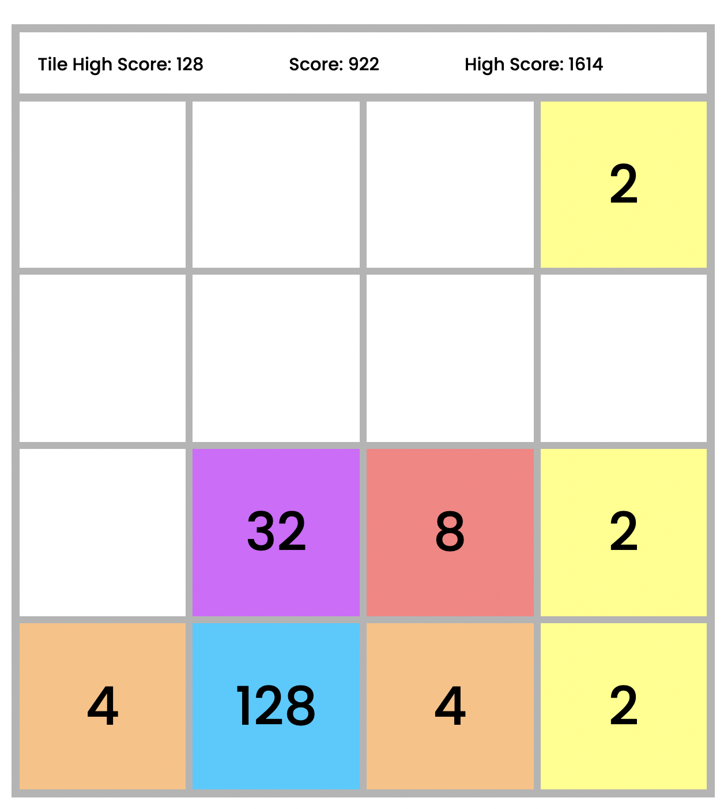

###  
# General Assembly, Software Engineering Immersive
# 2048 Project

## Overview

For my first GA project I wanted to make a modern internet classic: 2048. The logic behind making this game was fun to figure out and I enjoyed making it.

Stylistically I wanted to keep the game similar to how the original looked with it's nice clean sharp aesthetic.

It was also important for me for the game to scale nicely all the way down to mobile as classically its a mobile friendly game.

This project was completed in 1 week and was an individual project.

[You can play it here!](https://sirdantheawesome.github.io/project-1/) or click the link at the bottom of this readme.

## The Brief 

- **Render a game in the browser**
- **Design logic for the game ending and displaying the scores**
- **Include separate HTML / CSS / JavaScript files**
- Stick with **KISS (Keep It Simple Stupid)** and **DRY (Don't Repeat Yourself)** principles
- Use **Javascript** for **DOM manipulation**
- **Deploy your game online**, where the rest of the world can access it
- Use **semantic markup** for HTML and CSS (adhere to best practices)


## The Technologies used 

- HTML5
- CSS3
- JavaScript (ES6)
- Git and GitHub
- Google Fonts


## The Approach

### The Grid

This game was made using a 4 by 4 grid as this is the best way to play 2048. The code was built to account for possible other grid sizes but I felt it was best to stick to the classic 4 by 4

 ```js
 const width = 4
const tileArray = []
let addtile = false
let highestValue = 0
let score = 0
let highScore = 0

//* Setup Game

setup()
// For loop through the grid div children and add to array
function setup() {
  for (let i = 0; i < width ** 2; i++) {
    // Create tile div, add tile to page, add tile to array of tiles, make the tiles scale properly with flexbox
    const tile = document.createElement('div')
    elements.grid.appendChild(tile)
    tileArray.push(tile)
    tile.style.width = `${100 / width}%`
    tile.style.height = `${100 / width}%`
  }
  // Check for saves on localStorage, if there is no local storage do nothing, if there is then load the saves!
  if (localStorage) {
    highestValue = localStorage.getItem('highestValue') || 0
    elements.highestValue.innerHTML = highestValue
    highScore = localStorage.getItem('highScore') || 0
    elements.highScore.innerHTML = highScore
  }
  startGame()
}
 ```



### Scaling for different displays

I wanted the game to scale and play well on all displays. I achieved this by using a @media query to check whether the display is in portrait or landscape and scaling using view height or view width where appropriate.

```css
@media all and (orientation:portrait){
  #grid{
    width: 80vw;
    height: 80vw;
    border: 0.5vw solid rgb(180, 180, 180);
  }
  header{
    width: 80vw;
    padding: 2vw;
    border: 1vw solid rgb(180, 180, 180);
    border-bottom: 0.5vw;
  }
  #grid div {
    font-size: 6vw;
    border: 0.5vw solid rgb(180, 180, 180);
  }
  #end-screen {
  font-size: 3vw;
  height: 100vw;
  padding-top: 25vw;
  }
  #end-screen button {
    width: 20vw;
    font-size: 2vw;
  }
  #HV, #HS, #S {
    font-size: 2vw;
  }
}
```


### Mobile Friendly

Something I really wanted to achieve with this game was to have it equally playable on both desktop and mobile. So other than scaling I made sure both input types would work.

```js
//* Mobile Inputs:

let touchX = 0
let touchY = 0
let newTouchX = 0
let newTouchY = 0

document.addEventListener('touchstart', (event) => {
  // Save the start position of the touch
  touchX = event.touches[0].pageX
  touchY = event.touches[0].pageY
})

document.addEventListener('touchmove', (event) => {
  // Save the new position everytime its moved to get the last end pos
  newTouchX = event.touches[0].pageX
  newTouchY = event.touches[0].pageY
})

document.addEventListener('touchend', () => {
  //Find out which axis direction had the biggest change, compare direction and run a movement
  if (Math.abs(touchY - newTouchY) > Math.abs(touchX - newTouchX)) {
    if (touchY >= newTouchY) {
      shift('up')
    } else {
      shift('down')
    }
  } else {
    if (touchX >= newTouchX) {
      shift('left')
    } else {
      shift('right')
    }
  }
  addActiveTile()
  updateColors()
})

//* Deskptop Inputs:

document.addEventListener('keyup', (event) => {

  // make the const key = the key they was pressed
  const key = event.key

  // Check which input was pressed (takes arrow or wasd)
  switch (true) {
    case key === 'w' || key === 'ArrowUp': shift('up'); break
    case key === 'a' || key === 'ArrowLeft': shift('left'); break
    case key === 's' || key === 'ArrowDown': shift('down'); break
    case key === 'd' || key === 'ArrowRight': shift('right'); break
  }
  addActiveTile()
  updateColors()
})

```

## Challenges
Fixing bugs around how previously merged tiles should behave was interesting. I used a 'mergeable' class to add/remove from each tile to check whether or not it had merged previously that turn.

```js
if (
  tileArray[directionValue].innerHTML === tileArray[tileIndex].innerHTML
  && tileArray[tileIndex].classList.contains('mergeable')
  && tileArray[directionValue].classList.contains('mergeable')
  ) { // are they the same number?
      // Merge the tiles, make the new tile not mergeable again and remove the old tile from the active tile array
      tileArray[tileIndex].classList.remove('active')
      tileArray[tileIndex].innerHTML = ''
      tileArray[directionValue].innerHTML = (Number(tileArray[directionValue].innerHTML) * 2)
      tileArray[directionValue].classList.add('active')
      updateScores((Number(tileArray[directionValue].innerHTML)))
      activeTileIndex.splice(i, 1)
      tileArray[directionValue].classList.remove('mergeable')
      addtile = true
    }
```


## Victories 
Assigning colours based on tile values went very smoothly and colour values are very easy to edit in the code.

```js
function updateColors() {
  // finds the tile value each round and updates the colours of each tile accordingly
  tileArray.forEach((tile) => {
    switch (tile.innerHTML) {
      case '': tile.style.backgroundColor = 'white'; tile.style.color = 'black'; break
      case '2': tile.style.backgroundColor = '#ffff80'; tile.style.color = 'black'; break
      case '4': tile.style.backgroundColor = '#ffbf80'; tile.style.color = 'black'; break
      case '8': tile.style.backgroundColor = '#ff8080'; tile.style.color = 'black'; break
      case '16': tile.style.backgroundColor = '#ff809f'; tile.style.color = 'black'; break
      case '32': tile.style.backgroundColor = '	#d966ff'; tile.style.color = 'black'; break
      case '64': tile.style.backgroundColor = '	#ff00ff'; tile.style.color = 'black'; break
      case '128': tile.style.backgroundColor = '#00ccff'; tile.style.color = 'black'; break
      case '256': tile.style.backgroundColor = '#b300b3'; tile.style.color = 'white'; break
      case '512': tile.style.backgroundColor = '#660066'; tile.style.color = 'white'; break
      case '1024': tile.style.backgroundColor = '#006600'; tile.style.color = 'white'; break
      case '2048': tile.style.backgroundColor = '#000000'; tile.style.color = 'white'; break
    }
  })
}
```


## Potential future features
- Server side saving and scoreboards.
- Sliding animations.


## Lessons learned
- I got good practice with code refactoring while wrting the tile movement functions.
- Dynamically resizing the game so it looks consistent and nice on all display sizes was good. I didn't know about the orientation media query before this project.

### [Play the game Now!](https://sirdantheawesome.github.io/project-1/)